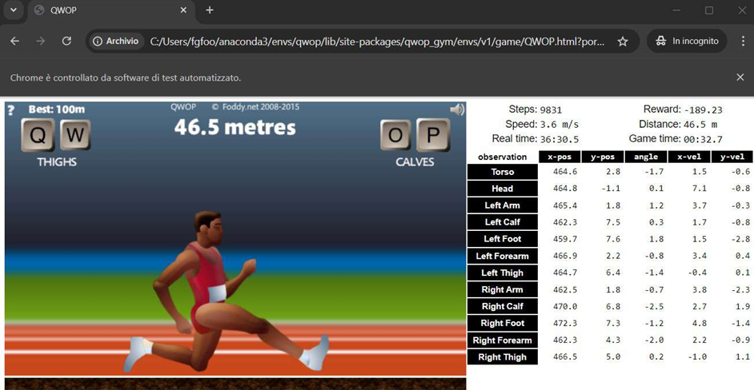
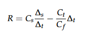
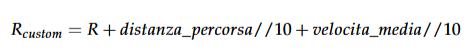

# Reinforcement Learning: sviluppo e valutazione di agenti intelligenti per il gioco QWOP

**QWOP** è un videogioco per browser, creato nel 2008 e noto per il suo approccio
al controllo del personaggio, basato sulla fisica ragdoll. Il giocatore controlla un corridore che deve percorrere 100
metri su una pista. Il movimento del corridore è controllato tramite combinazioni dei
tasti Q, W, O, P, da cui il nome del gioco. I primi due tasti controllano i muscoli delle
cosce; i restanti due controllano i muscoli dei polpacci. L’obiettivo è quello di sincronizzare i movimenti per far percorrere al personaggio 100 metri, in modo veloce, fluido e senza cadute. Gli algoritmi implementati e valutati sono 
**Monte-Carlo, SARSA, SARSA(λ)** e **Q-Learning**.




## Organizzazione del progetto
Di seguito è riportata una breve descrizione del contenuto delle diverse path del progetto.
 
`agents`: contiene l'implementazione degli algoritmi;

`training`: contiene gli script che invocano gli algoritmi in _agents_ per l'esecuzione di training e testing;

`results`: contiene i plot dei risultati del training e del testing;

`pretrained_models`: contiene i modelli pre-addestrati (in formato JSON), da sottoporre eventualmente a fine-tuning.

`QWOP_report.pdf`: è la documentazione del progetto.


## Ambiente utilizzato
È stato utilizzato l’ambiente qwop_gym, la cui repository GitHub è reperibile al link seguente: 
https://github.com/smanolloff/qwop-gym. Sono state utilizzate le caratteristiche di default dell'ambiente,
tranne che per la funzione di ricompensa, modificata nel modo seguente:

- **Funzione di ricompensa fornita dall’ambiente**:



- **Funzione di ricompensa personalizzata**:



Ulteriori dettagli e relative motivazioni sono reperibili nella documentazione del progetto.


# Requisiti
L'esecuzione del progetto richiede l'installazione delle dipendenze, da eseguirsi tramite il comando
```
    pip install
```